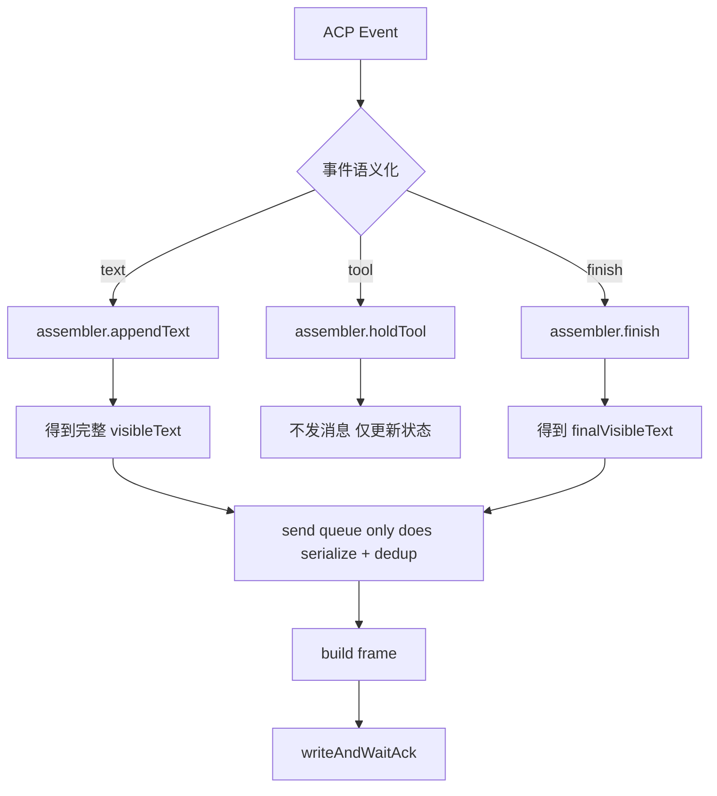

# 企微流式现状流程图与改造设计

## 1. 先回答当前问题

### 1.1 现在有打印输出日志吗

有，而且已经能看到发送侧关键日志。

从 [a.log](/Users/jahweijiang/Documents/agent-qhn/a.log) 可以直接看到以下几类日志：

- `wecom-ws: stream enqueue`
- `wecom-ws: stream aggregate`
- `wecom-ws: stream frame prepared`
- `turn complete`

这说明当前链路里至少这几层都在打印：

1. engine 结束 turn
2. wecom websocket 进入发送队列
3. wecom stream 聚合器生成最终展示内容
4. websocket frame 构建完成

### 1.2 日志里能看到什么异常

能看到两类典型现象。

#### 现象 A: 确实有流式发送

在 `2026-05-28 20:44:15` 这段，先收到 `agent_message_chunk: "对"`，随后立刻出现：

- `wecom-ws: stream enqueue ... stream_id=stream_39 finish=false content=对`
- `wecom-ws: stream frame prepared ... stream_id=stream_39 finish=false content=对`

说明当前不是“没发”，而是已经在发。

#### 现象 B: finalize 阶段内容重复/混乱仍然存在

在 `2026-05-28 20:37:47` 这段，最终 `finish=true` 的 frame 中，`stream aggregate` 输出里出现了明显的前缀内容重复两次。

也就是：

- `stream enqueue` 的 `content` 是一份内容
- 但 `stream aggregate` / `stream frame prepared` 里的最终内容，变成了“前半段 + 同一大段前缀再来一遍”

这和你说的“同一条消息混乱”“像同时推送多条消息”是对得上的。用户看到的不一定真是多条独立消息，也可能是同一个 `stream_id` 下被错误拼接成了重复内容。

## 2. 当前实现结论

当前问题不是单点 bug，而是三段逻辑叠加后的结果：

1. `core/engine` 同时维护 `textParts`、`partialText`、`fullResponse` 三套文本语义。
2. `core/streaming` 会把流式预览和最终结果分两阶段发送。
3. `platform/wecom/websocket` 还有一层 `aggregator + heldTool + lastAcked` 的二次聚合。

真正的风险点在于：

- engine 已经做过一次“最终展示内容拼装”
- wecom queue 又基于 `lastAcked` 做了一次“补前缀/补工具态/补 finalize”
- 长消息 finalize 还会再走 `splitByBytes` 分片

于是同一份语义内容会在不同层被重复推导，最后就容易出现：

- 前缀重复
- 工具块与正文交错
- 预览内容和最终内容边界不清
- 同一 `stream_id` 看起来像被多次乱序改写

## 3. 当前流程图

### 3.1 总流程

```mermaid
flowchart TD
    A[企微用户消息] --> B[WSPlatform.handleMsgCallback]
    B --> C[Engine.processInteractiveEvents]
    C --> D[ACP 事件流]

    D --> E1[EventText]
    D --> E2[EventToolUse / EventToolResult]
    D --> E3[EventResult]

    E1 --> F1[textParts 追加正文]
    F1 --> G1[streamPreview.appendText]
    G1 --> H1[WSPlatform.SendPreviewStart / UpdateMessage]
    H1 --> I1[sendStreamFrameAndWaitAck]

    E2 --> F2[textParts 追加工具块]
    F2 --> G2[tool_hold 模式下先不直接刷出]
    G2 --> I1

    E3 --> F3[fullResponse / deliverResponse 计算]
    F3 --> G3[sp.finish(deliverResponse)]
    G3 --> H3[FinalizePreviewMessage]
    H3 --> I2[sendFinalReplyChunks]
    I2 --> I1

    I1 --> J[enqueueLatestStreamSend]
    J --> K[runStreamQueue]
    K --> L[wsContentAggregator + heldTool + lastAcked]
    L --> M[buildStreamFrame]
    M --> N[writeAndWaitAck]
    N --> O[企微显示]
```

### 3.2 engine 侧文本流转

```mermaid
flowchart TD
    A[ACP chunk / tool / result] --> B{事件类型}

    B -->|EventText| C[textParts += 文本]
    B -->|EventToolUse| D[textParts += 工具消息]
    B -->|EventToolResult| E[textParts += 工具结果]
    B -->|EventResult| F[fullResponse = 最终回答]

    C --> G[sp.appendText(event.Content)]
    D --> H[tool_hold: 只进 textParts 不立即刷出]
    E --> H

    F --> I[deliverResponse = mergeStreamDisplayContent(...)]
    I --> J[sp.finish(deliverResponse)]
```

### 3.3 wecom websocket 发送流转

```mermaid
flowchart TD
    A[sendStreamFrameAndWaitAck] --> B[streamStateFor(reqID + streamID)]
    B --> C[enqueueLatestStreamSend]
    C --> D{是否 tool-only 且 finish=false}

    D -->|是| E[heldTool = 最新工具块]
    D -->|否| F[runStreamQueue]

    F --> G{aggregateThis?}
    G -->|否| H[直接 buildStreamFrame]
    G -->|是| I[aggregator.ingest/finalize]

    I --> J[必要时把 lastAcked 作为前缀补回]
    J --> H

    H --> K[writeAndWaitAck]
    K --> L[lastAcked = rendered]
```

## 4. 当前混乱点定位

### 4.1 重复不是单纯“多发一条”，而是“多层都在拼内容”

当前至少有三次内容拼接：

1. `engine` 把 `textParts` 拼成 stream 展示内容
2. `mergeStreamDisplayContent()` 再把 `streamContent` 和 `finalResponse` 合并一次
3. `wsContentAggregator` 在 queue 层又用 `lastAcked` 和 `heldTool` 再合并一次

这会导致每层都觉得自己在“补全”，实际上是在重复补全。

### 4.2 `lastAcked` 补前缀策略风险很高

当前 `runStreamQueue()` 里有这段核心语义：

- 如果本次要聚合
- 且 aggregator 还空着
- 且 `lastAcked` 不为空
- 且这次请求内容不是以上次内容为前缀

就先把 `lastAcked` 塞回 `plainSegments`

这个逻辑本意是“恢复上下文”，但在以下场景会误判：

1. preview 文本带了截断提示，如 `[内容较长，正在整理后续片段...]`
2. finalize 文本是同一语义内容，但不再包含这个提示
3. 长消息 finalize 先切第一片，第一片和上次 preview 文本不再是简单前缀关系

结果就是：

- queue 误以为“新内容不是旧内容的延续”
- 先补一份 `lastAcked`
- 再 append 本次 finalize chunk
- 最终把同一段大前缀拼了两遍

这和 `20:37:47` 那段日志高度吻合。

### 4.3 tool_hold 的状态机还不是单一事实来源

现在工具态相关状态至少分散在：

- `engine.textParts`
- `streamToolHoldNeedsAnswerSeparator`
- `wsStreamState.heldTool`
- `wsContentAggregator.pendingTool`

这意味着：

- engine 认为工具块已经进入最终文本
- queue 又认为工具块还处于待刷出状态

两边不是同一套状态机，最终容易出现重复刷、漏刷、顺序错。

## 5. 设计目标

改造目标应该明确成下面四条：

1. 同一条企微 stream 消息只能有一个“最终展示内容真源”。
2. preview 阶段和 finalize 阶段必须共享同一份状态，而不是各自重建。
3. engine 只负责产出事件语义，不负责为 wecom 重组最终展示文本。
4. wecom queue 只做“发送序列化”，不再做带猜测性质的二次补全。

## 6. 设计方案

### 6.1 总体原则

把当前三层“都在拼内容”，收敛成两层职责：

- `engine` 只产出标准化流式事件
- `wecom stream assembler` 独占组装企微最终显示文本

其中最关键的一点是：

`lastAcked` 以后只表示“已经成功发给企微的展示文本”，不能再被当作需要重新推导语义的输入。

### 6.2 新的分层职责

#### A. engine 层

只做事件投递，不再为 wecom 做额外展示拼装。

输出统一语义事件：

- `append_text(text)`
- `hold_tool(block)`
- `flush_tool_with_text(text)`
- `finish(final_text)`

engine 不再把 wecom 的最终文本通过 `mergeStreamDisplayContent()` 再拼一次。

#### B. wecom assembler 层

新增一个明确的单状态机对象，例如：

```go
type wecomStreamAssembler struct {
    visibleText string
    heldTool    string
    finished    bool
}
```

状态语义：

- `visibleText`: 当前这条企微消息应该显示的完整内容
- `heldTool`: 最近一个待并入正文的工具块
- `finished`: 是否已经结束

规则：

1. `append_text(text)`
   - 如果有 `heldTool`，先把 `heldTool` 并入 `visibleText`
   - 再把 `text` 追加到 `visibleText`
   - 返回新的完整 `visibleText`

2. `hold_tool(block)`
   - 仅覆盖 `heldTool`
   - 不立即发送 frame

3. `finish(final_text)`
   - 如果 `final_text` 非空，直接以 `final_text` 作为最终显示文本
   - 不再尝试用 `lastAcked` 反推或补前缀
   - 如果需要补工具块，只允许从当前 assembler 的 `heldTool` 补一次

### 6.3 发送层只负责串行和去重

`enqueueLatestStreamSend()` / `runStreamQueue()` 保留，但职责缩小为：

1. 同一 `reqID + streamID` 串行发送
2. 只保留最新待发送状态
3. 避免相同展示文本重复发送

不再负责：

- 从 `lastAcked` 反推前缀
- 在 finalize 时猜测需要补哪些历史内容
- 二次聚合工具块与正文

也就是直接删除这类逻辑：

- “如果新内容不是旧内容前缀，就把 `lastAcked` 塞回去”

这类逻辑不稳定，尤其在截断、长消息分片、preview notice 存在时一定会误伤。

### 6.4 finalize 长消息规则

长消息 finalize 必须固定为下面的确定性行为：

1. 先拿 assembler 产出的 `finalVisibleText`
2. 对它做一次 `splitByBytes`
3. 第一片走 `stream finish=true`
4. 后续片段走普通 `Send(markdown)` follow-up

注意：

- 分片发生在“最终可见文本”之后
- 不能先分片再进入 aggregator
- 否则第一片会被拿去和 `lastAcked` 再次混合，继续制造重复

## 7. 建议的目标流程图



## 8. 落地步骤

### 第一阶段: 先把问题收敛

1. 在 wecom queue 层移除 `lastAcked` 补前缀逻辑。
2. 保留最小能力：串行、最新覆盖、相同内容跳过。
3. 针对 `a.log` 里的长消息 finalize 场景补回归测试。

### 第二阶段: 统一 assembler

1. 把 `heldTool`、`pendingTool`、`streamToolHoldNeedsAnswerSeparator` 统一到单状态机。
2. engine 不再为 wecom 组装 `deliverResponse`。
3. wecom 只消费标准事件并自行生成 `visibleText`。

### 第三阶段: 做观测性

新增结构化日志字段：

- `phase=preview|update|finalize|followup`
- `render_source=append_text|hold_tool|finish`
- `visible_len`
- `held_tool_len`
- `dedup_skipped=true|false`

这样以后看到混乱时，可以直接判断：

- 是 engine 拼错了
- 是 assembler 状态错了
- 还是 send queue 重发/重排了

## 9. 我建议的下一步

下一步不要再直接小修补。

应该按下面顺序做：

1. 先删掉 `runStreamQueue()` 里基于 `lastAcked` 的补前缀逻辑。
2. 用 `a.log` 抽一组新的 regression case，覆盖“preview 截断提示 + finalize 长消息分片”。
3. 再把 tool_hold 从 engine 和 websocket 两边收敛成单一 assembler。

如果你同意，我下一步就按这份设计直接开始第一阶段改代码，先把“同一条消息前缀重复”和“finalize 混乱”这两个最硬的问题收掉。
